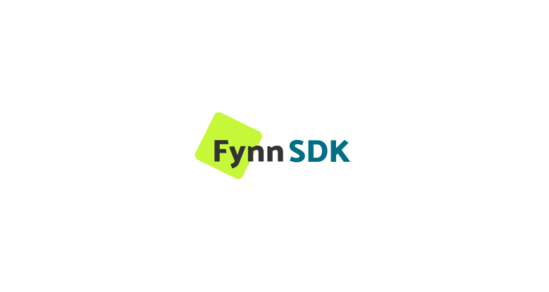

# Easy subscription billing with Fynn platform

The Fynn platform is a subscription management platform. This is the official documentation for the Fynn SDK.

The Fynn SDK is a PHP library that allows you to integrate the Fynn platform into your application.

## Documentation

The official documentation can be found [here](https://docs.fynn.eu/docs/developer/introduction).

## Contributing

The Fynn SDK is open source and can be found on [GitHub](https://github.com/fynn-digital/sdk-php).

If you want to contribute to the Fynn SDK, please read the [contribution guidelines](https://github.com/fynn-digital/sdk-php/blob/master/CONTRIBUTING.md).

## License

The Fynn SDK is licensed under the [MIT license](https://github.com/fynn-digital/sdk-php/blob/master/LICENSE.md).

## Support

If you have any questions, please contact us at [Developer Support](mailto:hi@fynn.eu).

## Changelog

The changelog can be found [here](https://github.com/fynn-digital/sdk-php/blob/master/CHANGELOG.md).

## Security

If you discover any security related issues, please email [Developer Support](mailto:hi@fynn.eu) instead opening an issue.
